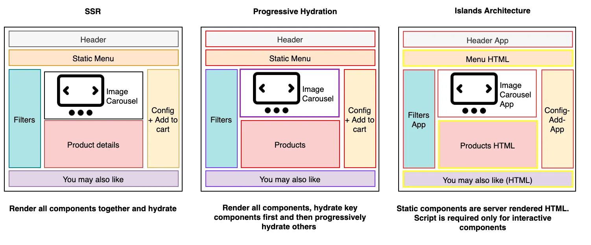

[[Ecommerce en Astro]]
[[instalar template astro]]
[[Optimizar rendimiento astro]]
[[Tener un pagespeedinsights como el de google pero para local]]
[[Correr pagina Astro en local comandos]]

## Sobre el framework Astro

[Astro](https://astro.build/) es un marco web de código abierto creado por Fred Schoot en 2021 para crear sitios web rápidos, de alto rendimiento y basados en contenido.

Astro es reconocido por su rendimiento, que se basa principalmente en su [arquitectura estática](https://hygraph.com/blog/what-is-a-static-website) . Esta arquitectura renderiza sitios web sin JavaScript, lo que reduce significativamente los tiempos de carga. Sin embargo, la popularidad de Astro en el ecosistema de desarrolladores se debe a su enfoque independiente del framework, que permite a los desarrolladores elegir sus herramientas preferidas sin dejar de beneficiarse de las funciones de Astro.

JavaScript es uno de los tres pilares fundamentales de la web y es crucial para la interactividad. Sin embargo, puede ralentizar la carga inicial de las páginas, especialmente en sitios con mucho contenido.

Muchos frameworks dependen en gran medida de JavaScript para la renderización y la interactividad. Sin embargo, Astro adopta un enfoque diferente al no usar JavaScript como salida predeterminada. Astro solo envía HTML y CSS al navegador cuando se carga una página web. JavaScript se incluye solo si se necesita explícitamente, lo que mejora significativamente el rendimiento. Este enfoque también mejora el SEO, ya que los motores de búsqueda pueden indexar fácilmente el contenido estático, lo que podría aumentar la visibilidad del sitio web.

Next.js generalmente impide que los desarrolladores usen bibliotecas de React, lo que les impide usar bibliotecas de Vue dentro del mismo proyecto.

Sin embargo, Astro no es un framework frontend, ya que no exige el uso de ninguna biblioteca de interfaz de usuario específica ni de capacidades específicas del framework. Gracias a su compatibilidad integrada, Astro permite a los desarrolladores elegir y combinar diversas bibliotecas y frameworks, como React, Vue y Svelte, para adaptarlos a las necesidades de su proyecto.




| Comparaciones       | Astro | Nuxt.js | Gatsby | Next.js |
| ------------------- | ----- | ------- | ------ | ------- |
| SSR                 | ✅     | ✅       | ✅      | ✅       |
| SSG                 | ✅     | ✅       | ✅      | ✅       |
| Partial hydration   | ✅     | ❌       | ❌      | ❌       |
| Island architecture | ✅     | ❌       | ❌      | ❌       |

### Estructura de carpetas

Un directorio de proyecto Astro después de su creación se verá así:

```
/my-astro-project
├── node_modules/
├── public/
├── src/
│   ├── components/
│   ├── layouts/
│   ├── pages/
├── env.d.ts
├── .gitignore
├── astro.config.mjs
├── package.json
├── package-lock.json
├── README.md
└── tsconfig.json
```

Como se vio arriba, la carpeta raíz de Astro consta de varios directorios y archivos. Examinemos algunos de estos directorios.

- **`public/`**:Esto contiene los archivos estáticos que no necesitan procesamiento.
- **`src/pages/`**:Los archivos aquí se convierten automáticamente en rutas.
- **`src/components/`**: Aquí se almacenan los componentes reutilizables. Por ejemplo, puede contener un archivo **`Header.astro`**para el encabezado del sitio.
- **`src/layouts/`**Los diseños ayudan a estructurar las páginas. Un ejemplo típico es [ **`MainLayout.astro`**texto faltante], que puede incluir un encabezado, un pie de página y un espacio para el contenido de la página.

El **`src`**directorio contiene el código fuente del proyecto y es donde se dedicará la mayor parte del tiempo de desarrollo.

### Enrutamiento

El enrutamiento de Astro está diseñado para ser simple e intuitivo. Esto se logra mediante **el enrutamiento basado en archivos** . En principio, todo el enrutamiento entre páginas utiliza las **`<a>`**etiquetas HTML estándar con el **`href`**atributo que apunta a la ruta especificada. Sin embargo, Astro también admite otros tipos de enrutamiento, como el dinámico y el estático.

El enrutamiento estático implica convertir todos los archivos del **`src/pages`**directorio con las extensiones **`.astro`**, **`.md`**o **`.mdx`**en páginas estáticas. Por ejemplo, **`src/pages/blog.astro`**se convierte en **`/blog`**.

Por otro lado, el enrutamiento dinámico implica el uso de corchetes **`[]`**para crear rutas que puedan gestionar segmentos variables en la URL. Por ejemplo, **`src/pages/blog/[slug].astro`**coincidiría con cualquier URL que empiece por **`/blog/`**, seguida de cualquier valor como **`/blog/first-post`**. El valor dentro de los corchetes se convierte en un parámetro que puede usarse en el código de la página.

Además de esto, también es posible crear rutas anidadas utilizando carpetas dentro **`src/pages`**.

Como se ve en todos los ejemplos anteriores, Astro no requiere ninguna configuración especial para crear rutas. Al igual que con Next.js o Nuxt.js, se pueden configurar fácilmente las rutas simplemente organizando los archivos dentro del **`src/pages`**directorio.

### Páginas

Las páginas constituyen las rutas que se encuentran en el **`src/pages/`**directorio de cualquier proyecto de Astro. Cada página de Astro se crea como un **`.astro`**archivo, y cada uno de estos archivos representa una vista o sección diferente a la que acceden los usuarios en el sitio web. Por ejemplo:

- **`index.astro`**corresponde a la página de inicio ( **`/`**)
- **`about.astro`**corresponde a la página acerca de ( **`/about`**)

Esta estructura basada en archivos en Astro se correlaciona directamente con las rutas URL de la aplicación web, lo que garantiza claridad y facilidad de desarrollo.

### Componentes

Los componentes Astro son unidades de código reutilizables e independientes que encapsulan partes de la interfaz de usuario, similares a las de los frameworks web modernos como Next.js y Nuxt.js. Son compatibles con diversos frameworks de JavaScript, lo que permite a los desarrolladores usar React, Vue, Svelte y otros junto con los componentes nativos de Astro.

Los componentes nativos de Astro usan la **`.astro`**extensión de archivo y suelen ubicarse en el **`src/components`**directorio. Se parecen a los archivos HTML, pero incluyen características adicionales como [frontmatter](https://jekyllrb.com/docs/front-matter/) , compatibilidad con ranuras y CSS con alcance.

Un componente Astro simple se verá así:

-- -

// Sección de portada

const title = "¡Hola, mundo!" ; 

-- -


```
< estilo >

  h1 {

    color : morado ;

  }

< / estilo >

< h1 > { título } < / h1 >

< p > ¡Este es un componente Astro ! < / p >
```


En el ejemplo anterior, se definió una constante **`title`**en la portada con el valor "¡Hola, mundo!". Se añadió CSS con alcance para aplicar estilos al **`<h1>`**elemento, garantizando que los estilos se apliquen únicamente a este componente. Finalmente, se incluyó el HTML que utiliza la **`title`**variable.

Para utilizar este componente en otro lugar, escriba:

-- -

importar Saludo desde '../componentes/Greeting.astro' ;   

-- -

< Saludo / > 


Este enfoque respalda los principios de No te repitas (DRY) y la separación de preocupaciones.

### Diseños

Los diseños que se encuentran en **`src/layouts`**un proyecto Astro permiten a los desarrolladores definir un diseño y una estructura comunes y consistentes, como encabezados, pies de página o navegaciones, que se pueden reutilizar en diferentes páginas, lo que garantiza que el sitio web tenga una apariencia cohesiva.

Si bien los diseños y los componentes son esenciales en un proyecto Astro, los componentes manejan elementos de UI reutilizables mientras que el diseño administra la estructura general de la página.

Los diseños contienen un **`<slot/>`**elemento que actúa como marcador de posición para insertar el contenido único de cada página. Exploremos un ejemplo de diseño sencillo.


```
< encabezado >

      < h1 > Higrafía < / h1 >

      < navegación >

        < a href = "/" > Inicio < / a >

        < a href = "/about" > Acerca de < / a >

      < / navegación >

    < / encabezado >

    < principal >

      < ranura / >

    < / principal >

    < pie de página >

      < p > & copia ; 2024 Hygraph < / p >  

    < / pie de página >
```


A continuación, los desarrolladores pueden usar la estructura definida anteriormente en las páginas. De la siguiente manera:

-- -


```
    importar WebsiteLayout desde '../layouts/WebsiteLayout.astro' ;   

    -- -

    < Diseño base >

      Bienvenido a mi sitio web​​​​​​ 

      < p > Esta es la página de inicio . < / p >

    < / BaseLayout >
```


Los desarrolladores también pueden crear múltiples diseños para diferentes secciones del sitio. Por ejemplo, se podría tener un diseño de blog para las entradas del blog y otro para otras partes del sitio web.

### Estilo

El estilo en Astro es flexible, y los desarrolladores pueden usar diversos métodos para aplicar CSS a cualquier componente y página. Esta flexibilidad es beneficiosa, ya que permite a los desarrolladores elegir el enfoque que mejor se adapte a las necesidades del proyecto, ya sea CSS con alcance dentro de los componentes (como se vio en un ejemplo anterior), estilos globales o frameworks CSS como [TailwindCSS](https://tailwindcss.com/) .

### Imágenes

Las imágenes son cruciales para el atractivo visual y la experiencia del usuario de cualquier sitio web. Astro admite la **``**etiqueta HTML estándar para imágenes estáticas, pero ofrece un componente integrado **`<Image/>`**para optimizar imágenes más grandes y mejorar el rendimiento.

Astro también permite cambiar el tamaño de las imágenes con atributos CSS como **`width`**y **`height`**, y admite la carga diferida para mejorar los tiempos de carga.

Para cumplir con los estándares de accesibilidad, Astro requiere el **`alt`**atributo para todas las imágenes. Para imágenes decorativas, Astro recomienda usar comillas vacías " **`alt=""`**" para indicar su propósito sin interrumpir la experiencia del lector de pantalla.


## Cuándo usar Astro

Astro destaca por sus numerosas características, que se han explorado en secciones anteriores. Sin embargo, hay algunos casos en los que Astro destaca más que otros frameworks. Algunos de ellos incluyen:

1. **Sitios web centrados en el contenido** : Las funciones SSG de Astro garantizan una carga rápida de las páginas mediante la prerenderización del HTML durante el proceso de creación. Esto lo hace ideal para sitios web con mucho contenido estático, como sitios de documentación, donde el objetivo principal es entregar contenido estático rápidamente.
2. **Sitios web enfocados en SEO:** La capacidad de Astro de no mostrar JavaScript por defecto mejora los tiempos de carga de las páginas y optimiza el SEO. Las páginas que cargan más rápido tienen más posibilidades de posicionarse mejor en los resultados de búsqueda, lo que convierte a Astro en una excelente opción para sitios web que dependen en gran medida de la visibilidad en buscadores.
3. **Sitios web centrados en el rendimiento:** El enfoque de Astro en SSG y el uso mínimo de JavaScript por defecto se traducen en tiempos de carga ultrarrápidos, lo que lo convierte en una excelente opción para sitios web donde el rendimiento es fundamental. Esto garantiza una mejor experiencia de usuario y menores tasas de rebote.
4. **Integración con CMS sin interfaz gráfica** : la compatibilidad de Astro con CMS sin interfaz gráfica como Hygraph hace de Astro una excelente opción para proyectos que requieren una gestión de contenido eficiente y una integración perfecta con un CMS sin interfaz gráfica.
5. **Preferencia por la flexibilidad:** La agnóstica naturaleza de Astro respecto a las bibliotecas y frameworks de interfaz de usuario permite a los desarrolladores usar React, Vue, Svelte u otros frameworks en conjunto. Esta flexibilidad es beneficiosa para proyectos que requieren la integración de diversas tecnologías o para equipos con experiencia diversa.

## [#](https://hygraph-com.translate.goog/blog/astro-javascript?_x_tr_sl=en&_x_tr_tl=es&_x_tr_hl=es&_x_tr_pto=sge&_x_tr_hist=true#when-not-to-use-astro)Cuándo no utilizar Astro

Si bien Astro es un framework potente y versátil, existen ciertas situaciones en las que podría no ser la mejor opción de desarrollo. Algunas de ellas incluyen:

1. **Aplicaciones de una sola página (SPA):** Astro es un framework de aplicaciones multipágina. Por lo tanto, no es adecuado para SPA altamente interactivas donde el enrutamiento del lado del cliente es crucial. En este caso, React o Vue podrían ser más adecuados.
2. **Aplicaciones con gestión de estados complejos:** Astro podría no ser la opción más adecuada para aplicaciones con requisitos de gestión de estados complejos e interacciones intensas del lado del cliente en comparación con Nuxt.js o Next.js.
3. **Cálculo intensivo del lado del cliente** : Las aplicaciones que requieren un alto nivel de cálculo del lado del cliente, como la visualización de datos o cálculos complejos, podrían no beneficiarse de las ventajas de Astro. En estos casos, un framework SPA con más capacidades del lado del cliente podría ser más adecuado.

Astro no es una solución única para todos; es importante saber dónde están sus puntos fuertes y cuándo es mejor utilizar un marco diferente.

## [#](https://hygraph-com.translate.goog/blog/astro-javascript?_x_tr_sl=en&_x_tr_tl=es&_x_tr_hl=es&_x_tr_pto=sge&_x_tr_hist=true#tips-and-best-practices)Consejos y mejores prácticas

Después de explorar varios aspectos de Astro, veamos algunas prácticas recomendadas que mejorarán su producto.

1. Al trabajar con imágenes, coloque las imágenes en la **`src`**carpeta en lugar de la **`public`**carpeta. Esto permite que Astro procese y optimice las imágenes, mejorando así el rendimiento. Los archivos de la **`public`**carpeta no se procesan, lo que puede reducir el rendimiento.
2. Aprovecha la información preliminar de los archivos Astro para incluir metadatos como títulos, descripciones y otra información relacionada con el SEO. Unos metadatos bien estructurados ayudan a mejorar el SEO del sitio.
3. Utilice CSS con alcance en los componentes Astro para evitar conflictos de estilo y garantizar que los componentes tengan estilos independientes. Este enfoque se basa en el principio de [separación de intereses](https://en.wikipedia.org/wiki/Separation_of_concerns) , lo que hace que el código base sea más limpio y fácil de mantener.
4. Si bien Astro ofrece funciones SEO integradas, también es beneficioso usar elementos HTML semánticos como **`<section>`**, **`<nav>`**y **`<article>`**. Estos elementos mejoran la accesibilidad y optimizan el SEO.
5. [Astro está en desarrollo activo. Sigue los canales](https://discord.com/invite/grF4GTXXYm) oficiales de Astro y consulta las [versiones](https://github.com/withastro/astro) regularmente para estar al tanto de las últimas funciones, mejoras y correcciones de errores.

## Integración de astro con otros frameworks

> [!question] 
> entonces astro se puede integrar con cualquier framework de js? que tal con cualquier framework de css? porque sucede esto? 

Sí, Astro está diseñado para ser muy flexible y se puede integrar con la mayoría de los frameworks de JavaScript y prácticamente cualquier framework de CSS.

---

### Integración con Frameworks de JavaScript

Astro te permite usar componentes de frameworks como **React, Vue, Svelte, SolidJS, y Preact** en tus proyectos. Esto es posible gracias a las **integraciones oficiales** (`@astrojs/react`, `@astrojs/vue`, etc.) que actúan como puentes. No solo puedes usar componentes de estos frameworks, sino que también puedes combinar varios en la misma página, por ejemplo, tener un componente de React junto a uno de Vue.

---

### Integración con Frameworks de CSS

La integración con frameworks de CSS como **Tailwind CSS, Bootstrap o Bulma** es aún más sencilla, ya que estos frameworks son fundamentalmente colecciones de estilos (clases de CSS). Astro maneja el CSS como un recurso estático, por lo que puedes importar sus estilos globalmente en tu proyecto o usarlos directamente en tus componentes, sin necesidad de una integración específica.

---

### El 'Porqué': La Arquitectura de Islas 🏝️

La razón principal de esta versatilidad es la **Arquitectura de Islas** de Astro. A diferencia de otros frameworks que envían todo el JavaScript de la aplicación al navegador, Astro opera de la siguiente manera:

1. Astro genera el sitio web como **HTML y CSS estático** por defecto.
    
2. Solo los componentes que necesitan interactividad (como un carrusel o un menú desplegable) se "hidratan" en el navegador, es decir, solo su JavaScript se envía y ejecuta. Estos componentes interactivos son las "islas" en un mar de HTML estático.
    
3. Esto permite que cada "isla" de interactividad pueda usar un framework de JS diferente sin entrar en conflicto con otras. . De esta manera, Astro logra enviar la menor cantidad de JavaScript posible, lo que resulta en una experiencia web más rápida y con mejor rendimiento.