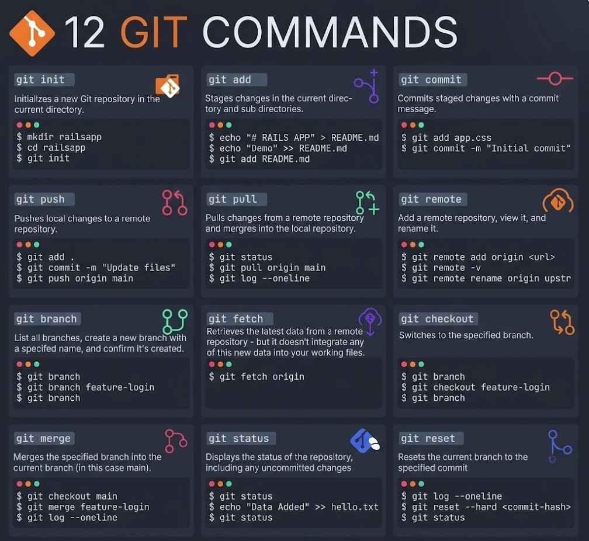

Después de entender la teoría, ahora viene lo más importante: la practica. O más bien lo esencial para la practica y de verdad usarlo.

Hay muchos comandos de Git, acá abajo dejaré una imagen que para mi resume los más importantes porque hay muchos que no se usan mucho realmente. De todos modos si no lo logras leer leer no importa porque más abajo explico y dejo para copiar cada uno.



## Casos aparentemente más "sencillos"
Hay varios casos que se pueden presentar cuando queremos usar Git y Github. El más sencillo aparentemente es subirlo directamente, esto es lo recomendado si no se van a hacer cambios [[subir aplicacion a internet]], si se van a hacer cambios hay que usar Git (a menos que cada cambio lo quieras subir manualmente lo cual no creo). También se puede usar Github desktop [[Subir a Github con Github Desktop]] pero honestamente a mi me parece incluso más dificil que Git (porque es más confuso en cambio con Git solo te memorizas los comandos que vas a necesitar que honestamente no son demasiados como parecen).

## Casos recomendados
[[Subir desde 0 con Git a Github al mismo tiempo en local y github]]
[[Git pull de repo existente]]
[[Cambiar de repositorio en Git]]
[[Actualizar en git]]
[[Subir a dos repositorios en git]]


## Caso iniciar git a repo existente desde local (no recomendado)
Si ya tienes un repo en github y deseas continuar lo más recomendable es hacer pull (traer los archivos a pc) antes de hacer push debido a que si se hacen los cambios solo en local (descargando los archivos por separado) se creara una nueva rama la cual no estará por default. En caso de que se quiera cambiar la rama no default por la default (la que tiene los nuevos cambios en local) hay que usar:

```bash
git push -u origin master:main --force
```

De todos modos si prefieres hacerlo asi:

[[Iniciar git enlazando a repo existente github]]


---

Extra
Para webs en github con astro: [[Correr pagina Astro en local comandos]]