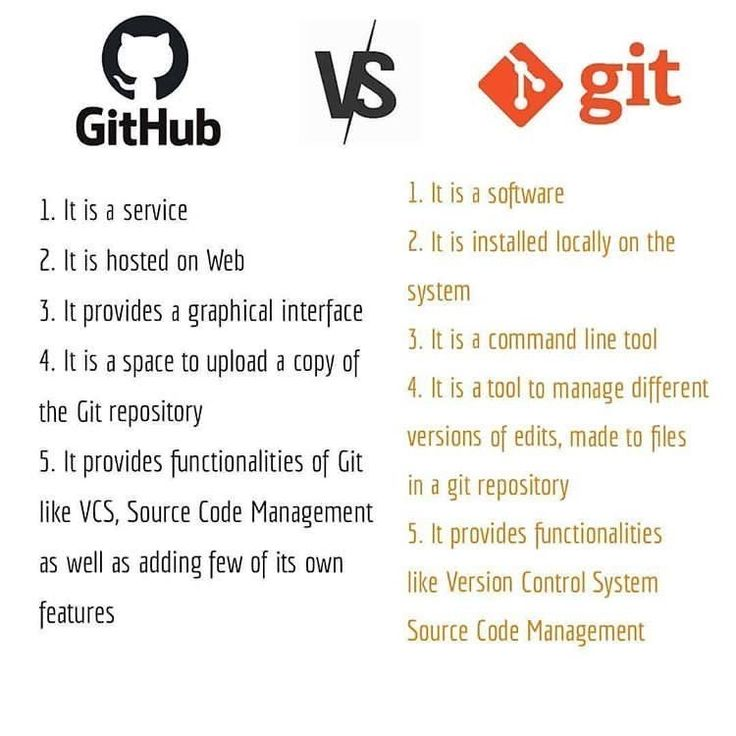

[[Git]]

[[subir aplicacion a internet]]
	[[Subir desde 0 con Git a Github al mismo tiempo en local y github]]
	[[Archivo Readme]]
	[[Subir a Github con Github Desktop]]
[[Issues y proyectos]]

> [!question] 
> Diferencias entre clonar y fork en github 

En GitHub, "clonar" (clone) y "forkear" (fork) son dos operaciones fundamentales, pero tienen propósitos y consecuencias distintas:

## **Clonar (Clone)**

**¿Qué es?**

- Clonar es **descargar una copia local de un repositorio remoto** (ya sea tuyo o de otra persona) a tu máquina.
- Esencialmente, estás obteniendo todo el historial del proyecto, sus ramas y archivos para trabajar en tu computadora.

**Propósito:**

- **Trabajo directo:** Se usa cuando tienes permisos de escritura en el repositorio original (eres el propietario, un colaborador o parte del equipo). Esto te permite hacer cambios localmente y luego subirlos directamente al repositorio remoto con `git push`.
- **Colaboración en equipo:** Común en equipos de desarrollo donde todos tienen acceso al mismo repositorio y necesitan trabajar en él.
- **Uso personal:** Si quieres una copia de un proyecto para usarlo o experimentar localmente sin la intención de contribuir al original.

**Dónde se realiza:**

- Se realiza utilizando el comando `git clone <URL_del_repositorio>` en tu terminal (línea de comandos) o a través de herramientas de escritorio de Git como GitHub Desktop.

**Relación con el repositorio original:**

- Tu copia local está directamente vinculada al repositorio remoto original. Los cambios que "pushees" afectarán directamente a ese repositorio.

## **Forkear (Fork)**

**¿Qué es?**

- Forkear es **crear una copia de un repositorio existente en tu propia cuenta de GitHub** (o en tu organización si tienes una).
- Es una copia a nivel de **servidor** (en la nube de GitHub), no en tu máquina local.

**Propósito:**

- **Contribuir a proyectos de código abierto:** Es la forma estándar de contribuir a proyectos en los que no tienes permisos directos de escritura. Creas tu propia copia (el fork), realizas tus cambios allí y luego sugieres esos cambios al repositorio original a través de un "Pull Request".
- **Desarrollo independiente:** Si quieres tomar un proyecto existente como base para un nuevo proyecto tuyo, pero quieres que permanezca desvinculado del original a largo plazo (aunque inicialmente esté vinculado para actualizaciones).
- **Experimentación:** Te permite hacer cambios drásticos o experimentar sin afectar el proyecto original.

**Dónde se realiza:**

- Se realiza directamente en la interfaz web de GitHub, haciendo clic en el botón "Fork" en la página del repositorio.

**Relación con el repositorio original:**

- Tu fork es una **copia independiente** del repositorio original. Tienes control total sobre tu fork y puedes hacer todos los cambios que quieras.
- Aunque es independiente, mantiene un vínculo con el repositorio original (llamado "upstream"). Esto te permite "tirar" (pull) las actualizaciones del repositorio original a tu fork para mantenerlo al día, y también "sugerir" (pull request) tus cambios al repositorio original.

## **Diagrama de flujo común:**

1. **Fork:** Creas una copia del repositorio de alguien más en tu cuenta de GitHub (en la nube).
2. **Clone:** Descargas tu **propio fork** (la copia en tu cuenta de GitHub) a tu máquina local.
3. **Trabajo:** Realizas cambios en tu copia local.
4. **Push:** Subes tus cambios de tu copia local a **tu fork** en GitHub.
5. **Pull Request:** Desde tu fork en GitHub, envías un Pull Request al repositorio original para que los mantenedores revisen e incorporen tus cambios.

### **En resumen:**

| Característica               | Clonar (Clone)                                                                      | Forkear (Fork)                                                                                      |
| :--------------------------- | :---------------------------------------------------------------------------------- | :-------------------------------------------------------------------------------------------------- |
| **Ubicación de la copia**    | En tu máquina local (tu computadora)                                                | En tu cuenta de GitHub (en la nube)                                                                 |
| **Comando/Acción**           | `git clone` (en terminal) / Botón "Clone" (en GitHub)                               | Botón "Fork" (en la interfaz web de GitHub)                                                         |
| **Permisos necesarios**      | Necesitas permisos de escritura en el repo original para hacer `push` directamente. | No necesitas permisos de escritura en el repo original. Obtienes tu propia copia.                   |
| **Propósito principal**      | Trabajar en un proyecto del que eres colaborador, o usarlo localmente.              | Contribuir a proyectos de código abierto, crear tu propia versión independiente.                    |
| **Relación con el original** | Tu copia local está directamente vinculada al original.                             | Tu fork es una copia independiente con un vínculo al original para actualizaciones y Pull Requests. |

En la mayoría de los casos de colaboración en proyectos de código abierto o cuando no tienes permisos de escritura directos, el flujo de trabajo es **forkear primero, luego clonar tu fork, trabajar, push a tu fork y finalmente enviar un Pull Request al original.**
 

> [!question] 
> Las pull requests en el fork se hacen para el repositorio original o son para el repositorio independiente que se ha hecho en la cuenta de github? 

Las Pull Requests (PRs) **se hacen desde tu repositorio "fork" (la copia independiente que tienes en tu cuenta de GitHub) hacia el repositorio original** (también conocido como "upstream").

**Para entenderlo mejor, desglosemos el proceso:**

1. **Fork:** Cuando haces un "fork" de un repositorio (por ejemplo, el repositorio `awesome-project` de `original-user`), GitHub crea una copia de ese repositorio en tu propia cuenta. Ahora tienes `your-username/awesome-project`. Este es tu repositorio independiente.
    
2. **Clone:** Luego, típicamente, clonas **tu propio fork** a tu máquina local. Así, trabajas en `your-username/awesome-project` en tu computadora.
    
3. **Realizas cambios:** Haces las modificaciones, añades funcionalidades, corriges errores, etc., en tu copia local.
    
4. **Push a tu fork:** Una vez que estás satisfecho con tus cambios locales, los "empujas" (`git push`) a **tu fork en GitHub** (`your-username/awesome-project`). Tus cambios ahora están visibles en tu repositorio independiente en la nube.
    
5. **Crear la Pull Request:** Aquí es donde viene la clave. Desde la interfaz de GitHub (cuando estás en la página de tu fork), verás una opción para crear una "New pull request". Al hacer clic en ella, GitHub automáticamente te sugerirá una PR que va:
    
    - **"base repository"**: El repositorio original (`original-user/awesome-project`).
    - **"head repository"**: Tu fork (`your-username/awesome-project`).
    
    Estás, en esencia, diciendo: "Hey `original-user`, mira los cambios que hice en `your-username/awesome-project`. ¿Te gustaría incorporarlos en tu `awesome-project` principal?"
    

**¿Por qué no a tu propio fork?**

No tiene sentido hacer una Pull Request de tu fork a tu propio fork. Ya que eres el dueño de tu fork, puedes simplemente `push` tus cambios directamente a él. Las Pull Requests son herramientas para **proponer cambios a otro repositorio** (generalmente el repositorio del que te "forkeaste" o "upstream").

**En resumen:**

Las Pull Requests son el mecanismo para que los mantenedores del proyecto original revisen y, potencialmente, fusionen tus contribuciones en el código base principal.