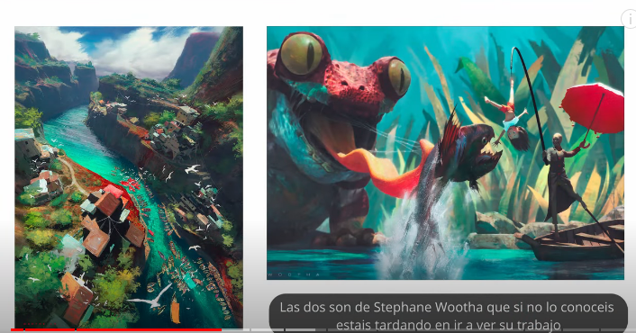
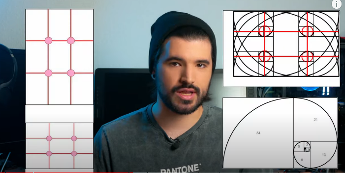
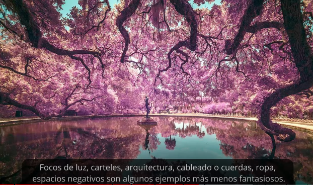
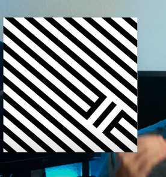
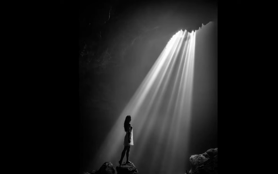
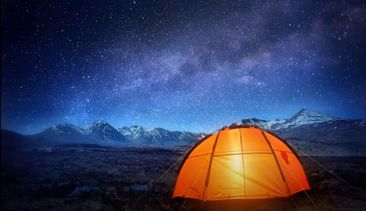
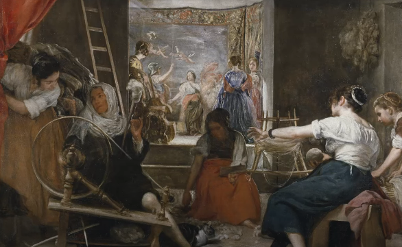
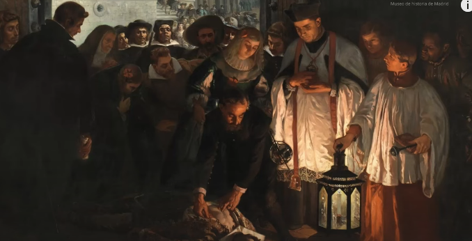

---
title: Tipos de composiciones con ejemplos
description: Como saber cual composición usar
pubDate: 2026-02-08
tags:
  - dibujo
  - diseño
  - Notas
  - Resumenes
---

## Narración y simbología
el orden de las imágenes si altera el producto. pensar en como se le narraría la escena a alguien con simbolismo, posición, símbolos, etc. cuales elementos son los importantes y cuales son los de relleno. orden de importancia. la composición se pone a la orden de la narración.

Las dos imágenes poseen buena composición. una nos cuenta una historia y otra no. a pesar de que las dos son buenas, se recordara mas la que tiene una historia.

## Regla de los tercios, puntos de interés

Ayuda a tener la imagen balanceada. para no tener un punto de la imagen lleno de información y la otra completamente vacía. lo que suele funcionar es un 70, 30. También 50, 50 o 10, 90, etc.

70 información, 30 vacía o viceversa.

## balancear imagenes

- los ojos
- las manos
- los textos
- los animales
- personas

todos estos son elementos que llaman la atención en una imagen y es en lo que se foca el ojo una persona. ej. si tenemos un personaje de frente y otro de espaldas el que primero se mirara es el que esta de frente, luego el ojo se guiara a donde esta mirando esa persona. otro ejemplo, si en la composición el personaje no es tan importante pero si el objeto entonces se puede hacer que la persona mire al objeto para hacer énfasis. lo mismo con las manos o las extremidades.

## flechas

- extremidades
- cuernos
- espadas
- alas
- ramas

## contraste

- grande o pequeño
- detallado o sin detallar
- brillante o desaturado
- luz o sombra
- geometría
- enfocado o desenfocado

⬆️ detallado y sin detallar ⬆️

## Luz

dureza de la luz, color, como están dispuestos. se puede esconder elementos y enfocar elementos con la luz

## marcos

cuevas, ventana, el marco de una puerta, claro en el bosque, nido en un pajaro, hueco en la multitud, aureola para los santos, capuchas, barrancos en un paisaje, ramas, etc.