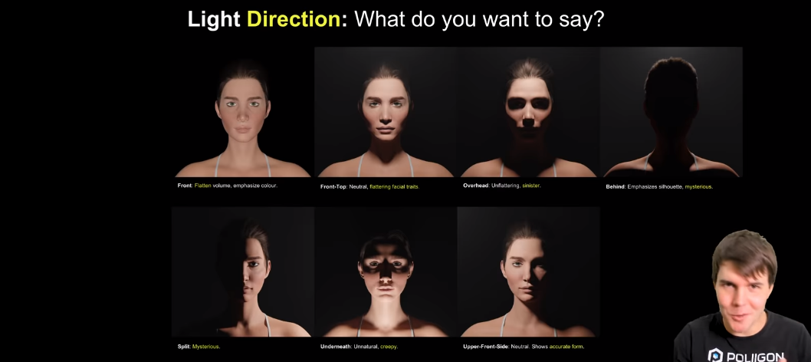
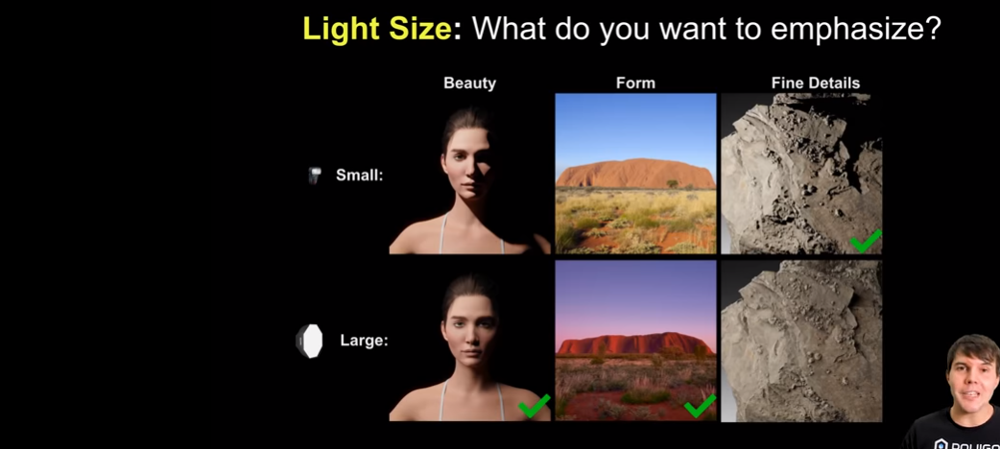
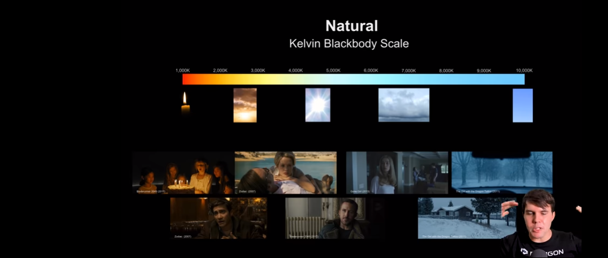
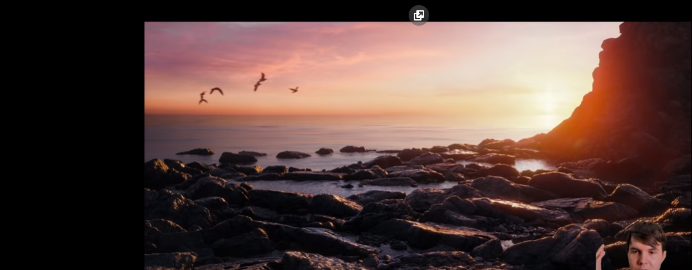
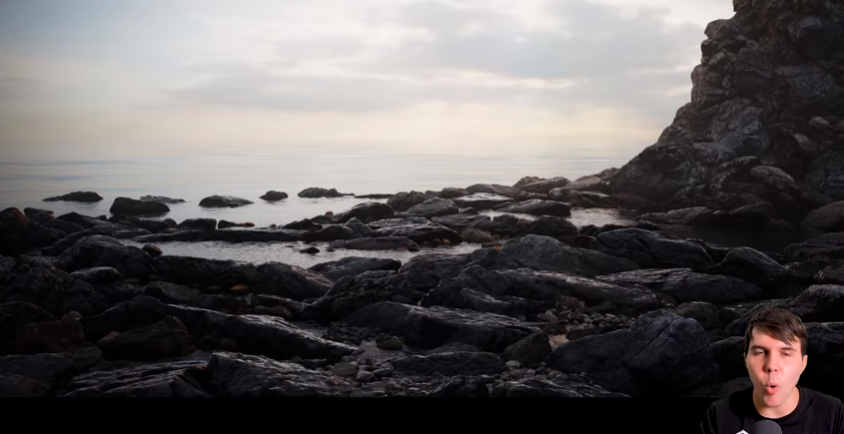
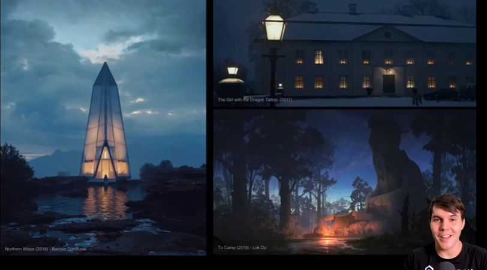
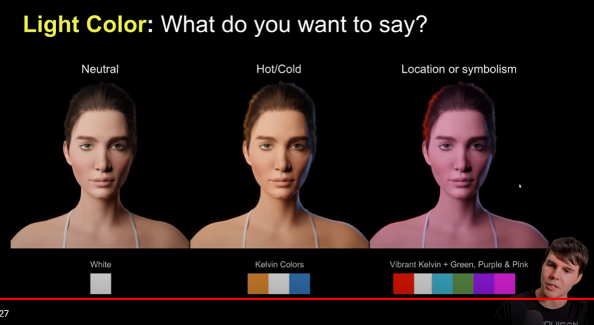

---
title: Entiende la iluminación
description: Conceptos de como usar la luz correctamente para dibujo o animación 3D/2D
pubDate: 2026-02-08
tags:
  - Notas
  - 3D
  - Cursos
  - dibujo
---

1. Luz frontal: Enfatiza volumen, enfatizar el color
2. Luz front top: Enfatiza volumen, neutral
3. Sobre la cabeza: No enfatiza, siniestro
4. Atrás: Enfatiza la silueta, misterioso
5. Split: Misterioso
6. Abajo: No natural, creepy
7. Upper front side: Neutral, muestra la forma real de la cara

- Si se quiere afinar los detalles se aumenta el enfoque
- Se se quiere un enfoque amplio, los detalles se eliminan

- Los colores se relacionan con la cultura no necesariamente con conceptos generalizados

- Luz calida: da sensacion de cercania y emociones positivas
- Luz fria: da sensacion de tristeza y frialdad
- Se relaciona con [[Teoría del color]]

Mezcla de dos.

