---
title: Resumen de la teoría del color
description: ¿Qué es la teoría del color? Ejemplos con imágenes y resumen
pubDate: 2026-02-08
tags:
  - dibujo
  - Notas
  - teoria
---

https://color.adobe.com/es/create/color-wheel

Si se quieren usar colores específicos para la relacion de colores ⬆️

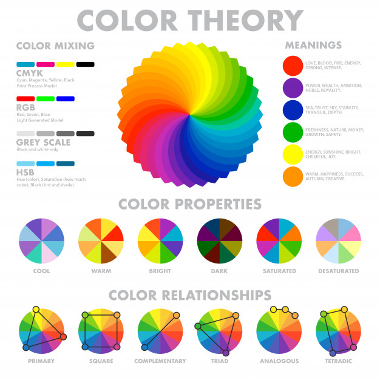

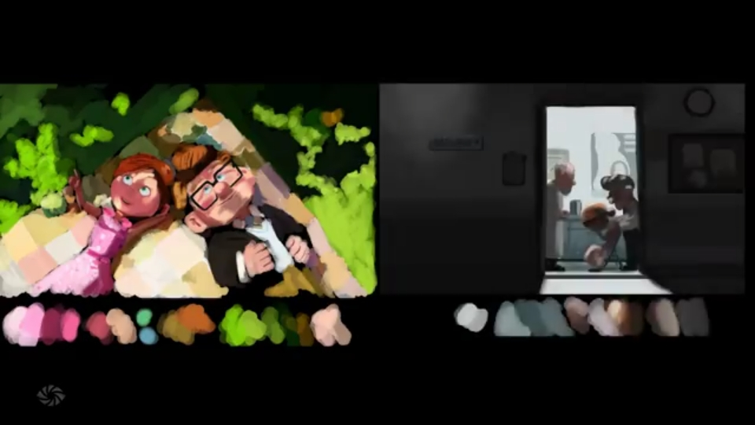

Colores vibrantes y cálidos expresan felicidad y cercanía. Colores grises y apagados se relacionan con tristeza, depresión. Se relaciona con [[Curso-lighting]]

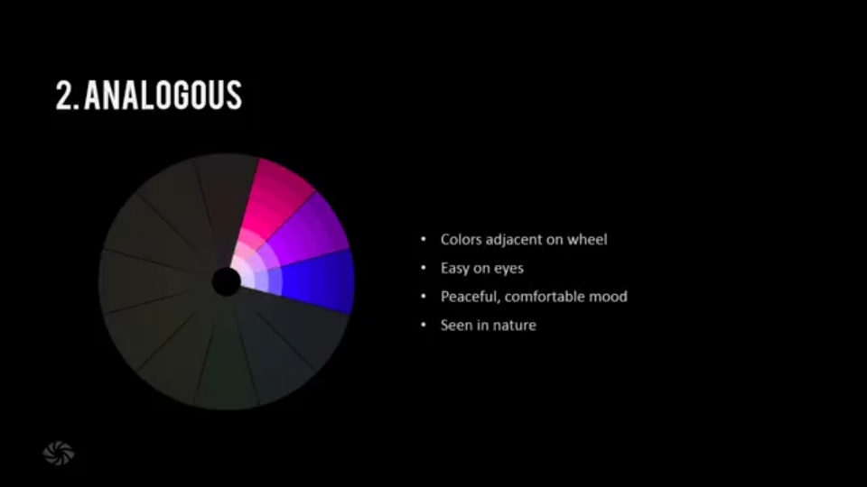

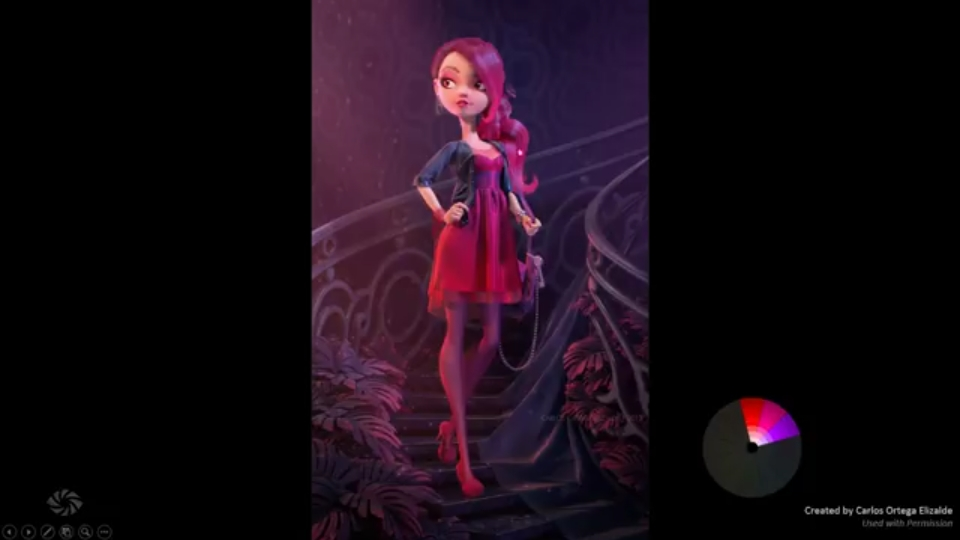
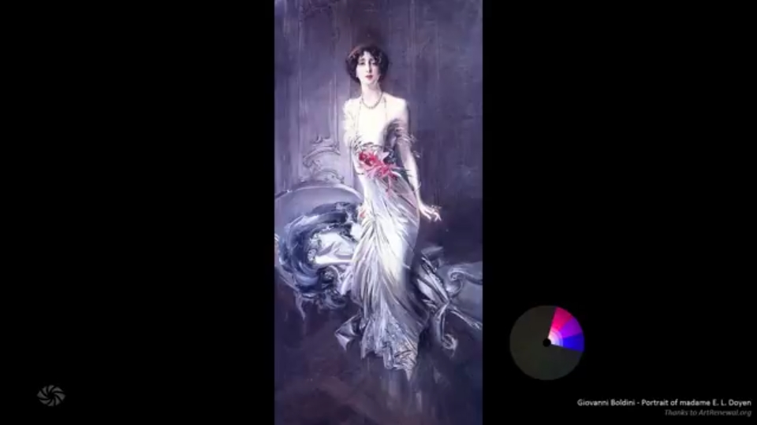

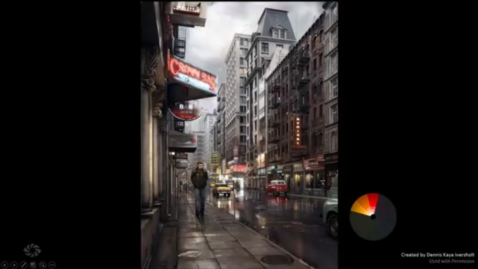
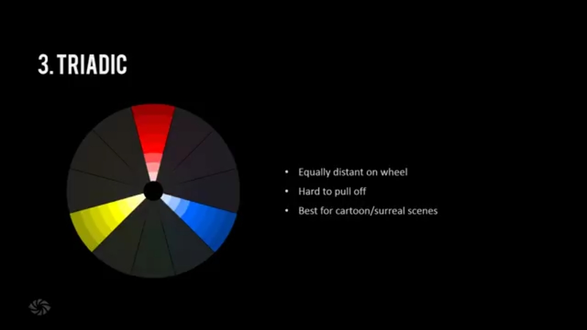
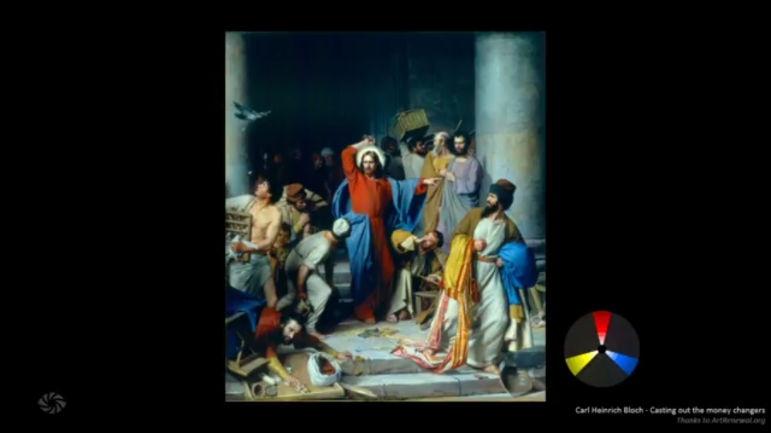
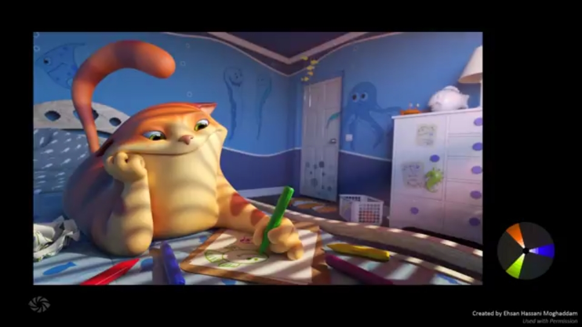
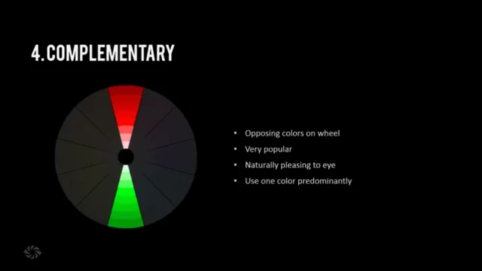

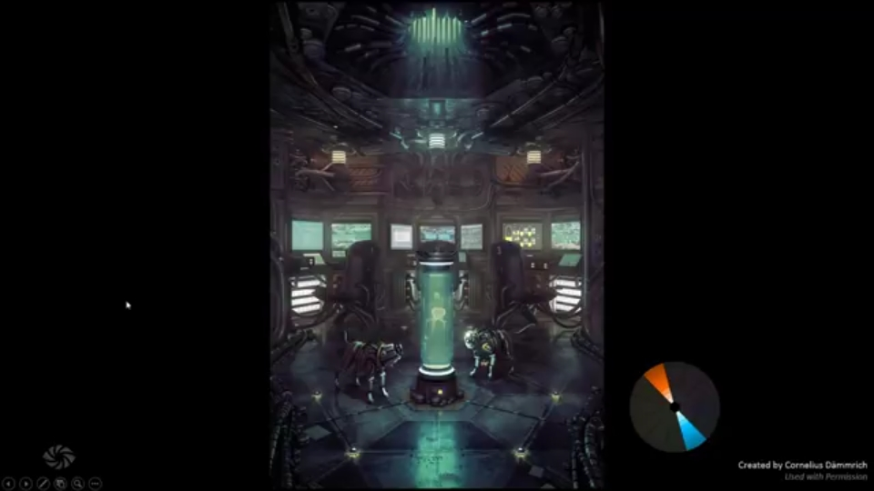
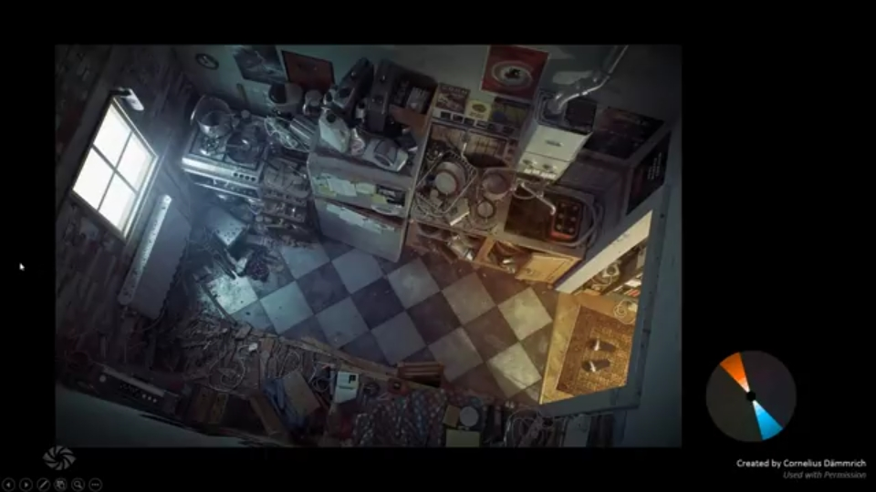
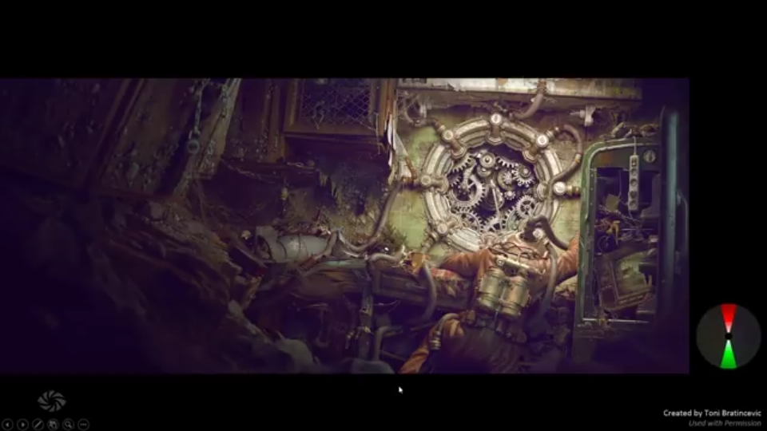
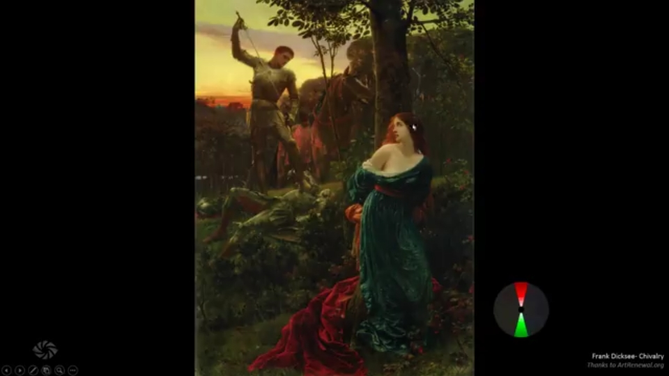
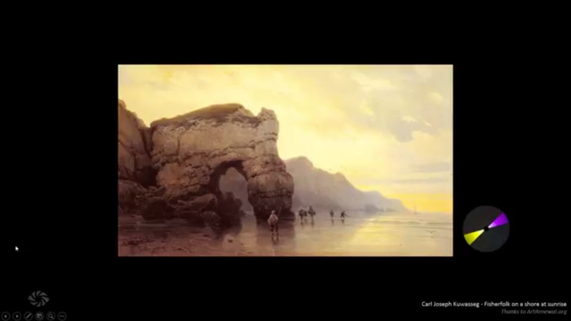
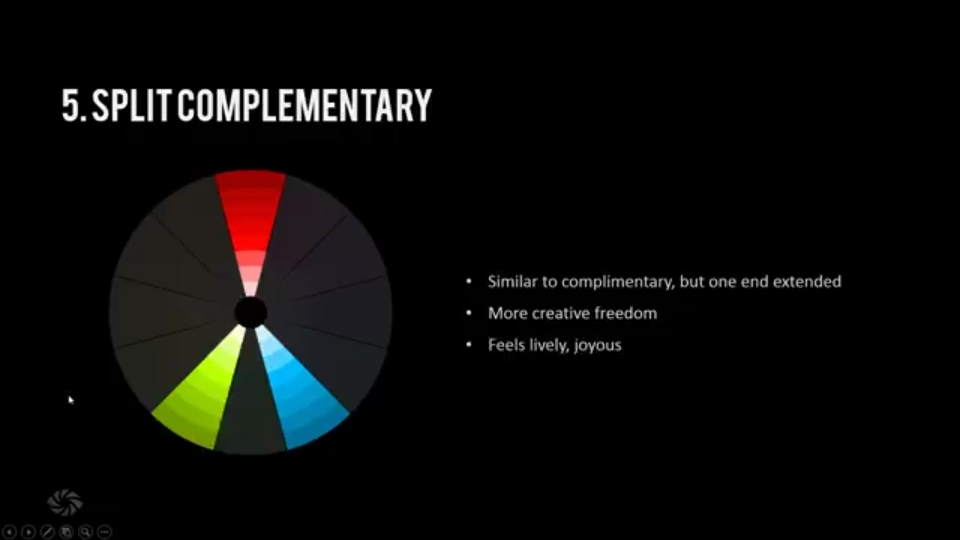
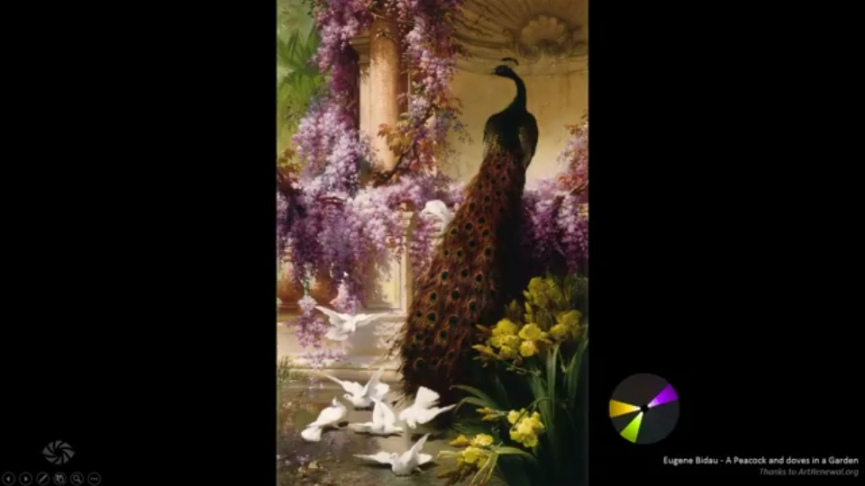
